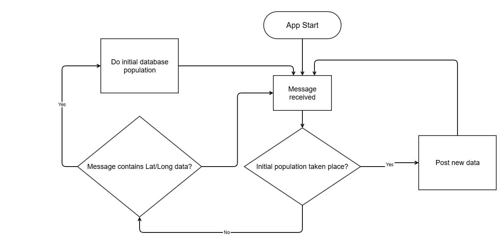

# Introduction

Frost is a server implementation of the OGC Sensor Things API, work was completed in a March 2025 sprint to develop this with NRT data from the James Cook.

The Frost application listens to an MQTT stream from the RRS James Cook to gather meteorology, positional and voltage data. The application then posts this in near real time to a system called the Frost API which exposes the data to the public.

The app is visible at the following locations:

| Environment | Develop | Test | Production |
|------------|---------|------|------------|
| Internal   | [https://frostdev.bodc.uk/FROST-Server/](https://frostdev.bodc.uk/FROST-Server/) | [https://frosttst.bodc.uk/FROST-Server/](https://frosttst.bodc.uk/FROST-Server/) | [https://frost.bodc.uk/FROST-Server/](https://frost.bodc.uk/FROST-Server/) |
| External   | [https://dev.linkedsystems.uk/sensorthings](https://dev.linkedsystems.uk/sensorthings) | [https://tst.linkedsystems.uk/sensorthings](https://tst.linkedsystems.uk/sensorthings) | [https://linkedsystems.uk/sensorthings](https://linkedsystems.uk/sensorthings) |

# FROST Guide

Frost has a simple UI which can handle requests to retrieve, insert, update or delete data, and there are also endpoints which directly expose the different entities.

An overview of the different endpoints available (for production) are as follows.

| Name | Endpoint(s)| Description |
|------------|---------|------|
| Thing             | [https://frost.bodc.uk/FROST-Server/v1.1/Things](https://frost.bodc.uk/FROST-Server/v1.1/Things)     | This represents some real world item where a sensor lives, in this case it is the RRS James Cook. |
| Locations         | [https://frost.bodc.uk/FROST-Server/v1.1/Locations](https://frost.bodc.uk/FROST-Server/v1.1/Locations)   [https://frost.bodc.uk/FROST-Server/v1.1/Locations(2)](https://frost.bodc.uk/FROST-Server/v1.1/Locations(2)) | The location of where the Thing is. As the ship is moving each message results in a new location being posted. |
| Sensors          | [https://frost.bodc.uk/FROST-Server/v1.1/Sensors](https://frost.bodc.uk/FROST-Server/v1.1/Sensors) | A description of the sensors aboard the ship|
| ObservedProperties | [https://frost.bodc.uk/FROST-Server/v1.1/ObservedProperties](https://frost.bodc.uk/FROST-Server/v1.1/ObservedProperties) | This describes what the sensor is measuring |
| FeaturesOfInterest | [https://frost.bodc.uk/FROST-Server/v1.1/FeaturesOfInterest](https://frost.bodc.uk/FROST-Server/v1.1/FeaturesOfInterest) | This is the object in which the measurement is performed upon, in our case it is the air. |
| Datastreams       | [https://frost.bodc.uk/FROST-Server/v1.1/Datastreams](https://frost.bodc.uk/FROST-Server/v1.1/Datastreams) | This links together a Thing, a Sensor and an Observed Property. |
| Observations      | [https://frost.bodc.uk/FROST-Server/v1.1/Observations](https://frost.bodc.uk/FROST-Server/v1.1/Observations)   [https://frost.bodc.uk/FROST-Server/v1.1/Observations(3)](https://frost.bodc.uk/FROST-Server/v1.1/Observations(3)) | These are the individual measurements linked to a data stream. A new observation is posted per valid message received. |
| HistoricalLocations | [https://frost.bodc.uk/FROST-Server/v1.1/HistoricalLocations](https://frost.bodc.uk/FROST-Server/v1.1/HistoricalLocations)   [https://frost.bodc.uk/FROST-Server/v1.1/HistoricalLocations(4)](https://frost.bodc.uk/FROST-Server/v1.1/HistoricalLocations(4)) |  This keeps track of all locations visited by the thing. |

See diagram below for a visual representation of the entities, and how they relate

Further information about the OGC SensorThings API specification is available [here](https://www.ogc.org/publications/standard/sensorthings/)

# App Overview

The app has two distinct stages, the **initial population** and **patching**

**Initial Population** - This is when the database is empty, and the app is being newly deployed. When the first message containing a latitude/longitude is received, the locations.json is populated and this posted to Frost along with the rest of the static JSON.

1. The initial population interacts with: locations.json, and it substitutes the latitude/longitude values in the JSON object with the ones in the message.
2. The following JSONS are then opened and posted to Frost: things.json, locations.json, observed_properties.json, sensors.json, datastreams.json features_of_interest.json

**Patching** - This is the usual running state of the app, and assumes that the initial population is complete. Whenever a new location or observation is received, the relevant entities are updated.

1. If a new location is received, the locations.json is substituted as earlier and posted again. This creates a new location entity as well as a new historical_locations entity. it also causes the shape in datastreams to change to reflect the location.
2. If a new observation is received, the observations.json is substituted and this is posted, creating a new observations entity.

Developers Guide

The app can be ran locally with the docker compose file (note that there is a local docker compose and one specifically for deployment).

	1. Make sure you are in the directory with the docker-compose.yml file, then run docker compose up --d --build 

	2. Once built, navigate to the Frost UI in your browser: [http://localhost:8080/FROST-Server/v1.1/](http://localhost:8080/FROST-Server/v1.1/)
	
	3. Check the console in Docker, and you should see a message indicating the posting of the initial data has taken place.

	4. Once this message is received there is now data, in the UI add 'Things' to the URL and enter, you should see the Things entity.

	5. The app will now be in the patching phase, and new locations and observations will be added as new messages arrive.
	
The usual rules apply to development, and tox can be ran for the type-checking, linting and tests by doing the following:

	1. Navigate to python_app
	2. Create a new virtual environment and install poetry & tox into i
	3. To run tests: tox -e py3 
	4. To run linting: tox -e lint 
	5. To run formatting: tox -e format 
	6. To run the type checker: tox -e types 
